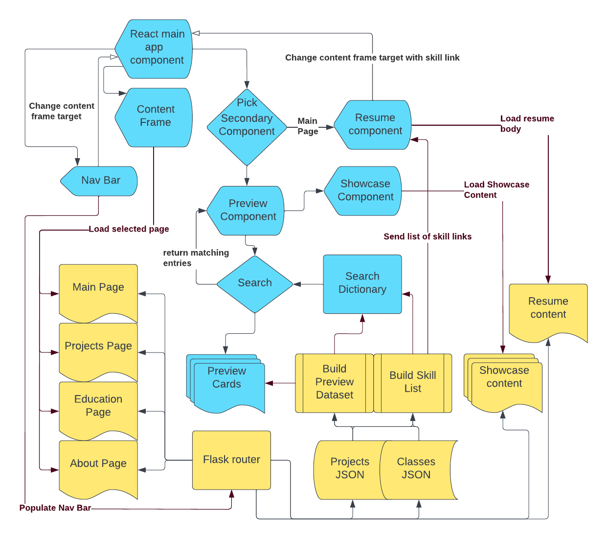

# RF_personal_site
    This website is built on the hybridization of
    React as a front-end view and Flask as a back-end API serving html, json, images, and files.
    Going into the creation of this site I knew nothing about React and was less practiced with Flask/Python,
    building this site was a very useful learning experience.

    The project and education pages contain a small search engine. It is used twofold to allow visitors to
    filter for specific keywords, and to allow the resume links on the front page to easily go to
    specific classes or projects.

    I built a data flow diagram to help explain the structure of the site, check it out!

    